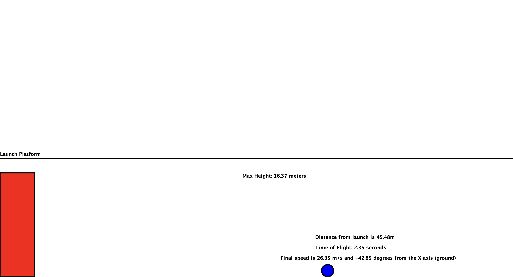

# Projectile Motion Simulator

A Java-based console application that simulates projectile motion physics, calculating key metrics such as maximum height, time of flight, horizontal distance, and final velocity components.

## Overview

This simulator allows users to model projectile motion by entering initial launch parameters in the command line. The program applies classical mechanics equations to compute various properties of the projectile's trajectory, making it useful for physics education, homework verification, or general exploration of projectile motion.

## Features

- **Physics Calculations**:
  - Maximum height reached during flight
  - Total time of flight
  - Horizontal distance traveled
  - Final velocity magnitude and angle
  - Velocity components
- **Multiple Launch Scenarios**:
  - Standard projectile launches
  - Vertical launches (90° angle)
  - Launches from elevated positions
  - Negative angle launches (downward)
- **Precision Results**: All calculations rounded to appropriate decimal places

## Known Limitations

- Does not account for air resistance
- Assumes constant gravity (9.81 m/s²)
- No collision detection with terrain
- Limited to 2D motion (no lateral wind)

**Note**: All calculations use SI units (meters, seconds, m/s).

